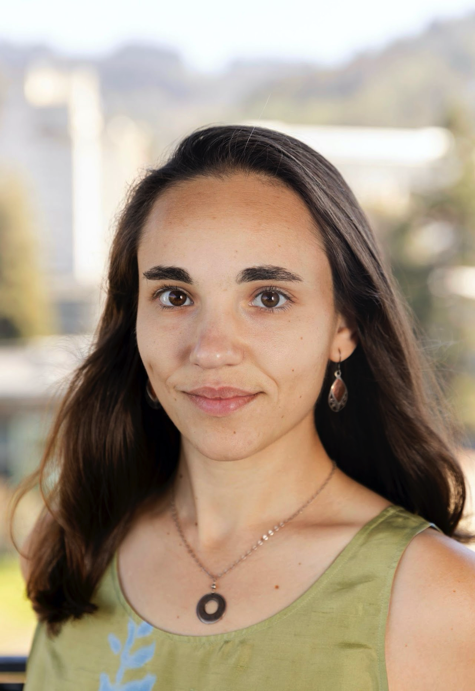

<!--- <div class="banner-image"></div> --->

```{=html}
<style>
.profile-image {
  float: left;
  width: 150px;
  margin-right: 20px;
  margin-top: 20px;
  display: block;
}

</style>
```

{.profile-image}

::: about-text
Welcome!

I am a Postdoctoral Fellow at the <a href="https://csdp.princeton.edu/"
   target="_blank" rel="noopener"
   style="text-decoration:none; color:#1e3a8a;"> Center for the Study of Democratic Politics </a> at Princeton University. In 2026-2027, I will join the <a href="https://cities.harvard.edu/initiatives/local-politics-lab/" 
   target="_blank" rel="noopener"
   style="text-decoration:none; color:#1e3a8a;"> Local Politics Lab </a> at Harvard as a postdoctoral researcher. In 2027, I will begin as an Assistant Professor of Political Science at Williams College. I received my PhD from the Department of Political Science at the University of California, Berkeley.

My research is broadly focused on representation, local political economy, and political geography. Specifically, I study who holds power in American local governments, how that drives decision-making, and whose interests are reflected in policy. I am especially interested in these dynamics in small-town America. Another branch of my research explores attitudes about descriptive representation. My work combines descriptive and causal methods, including designs for causal inference with observational data, text analysis, and original surveys and survey experiments. My research is published in the *Journal of Politics*, *Political Behavior*, and the *Journal of Political Institutions and Political Economy*.

I hold a B.A. in Political Science, Philosophy, and German from Tufts University. Prior to graduate school, I was a research associate in the Political Science department at MIT.

<small><em>
*I am also part of a research team studying local decision-making. If you are here because you received an email from me, please consider participating. We want to hear your perspective!*
</em></small>
:::

::: {style="clear: both;"}
:::

::: {style="text-align: center;"}
<a href="mailto:aweissman@princeton.edu" class="button"><i class="fas fa-envelope"></i> Email</a> <a href="https://github.com/a-weissman" class="button"><i class="fab fa-github"></i> GitHub</a>
:::


